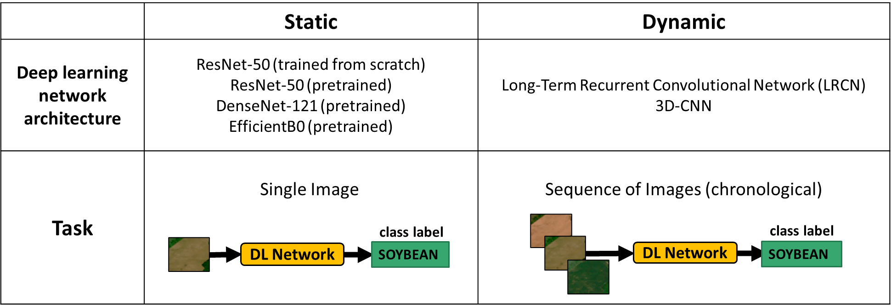
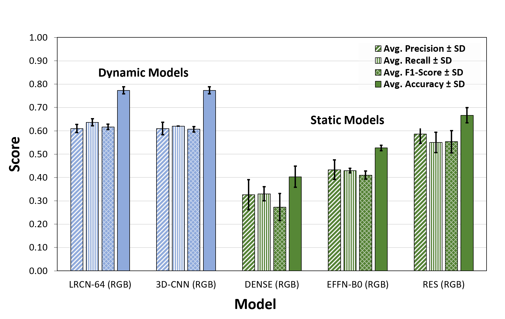

  

    Table of contents
  

  {: .text-delta }
1. TOC
{:toc}

We present two classification experiments performed using the 2019 version of the dataset to infer the main crop types present in each image. In the first experiment, *static classification*, we treated each individual image as a training instance (static image classification). In the second experiment, *dynamic classification* we explored the use of a temporal image series as an input. 

 
## Results

### Static Classification  

The deep learning models used for the static classification task include the [*ResNet-50*](https://arxiv.org/abs/1512.03385), the [*DenseNet*](https://arxiv.org/abs/1608.06993) and the [*EfficientNet-B0*](https://arxiv.org/abs/1905.11946).   

<table style="border-collapse: collapse; table-layout: fixed; width: 100%;">
  <tr>
    <th style="border: 1px solid black; text-align: center;">Models/Metrics</th>
    <th style="border: 1px solid black; text-align: center;">Precision</th>
    <th style="border: 1px solid black; text-align: center;">Recall</th>
    <th style="border: 1px solid black; text-align: center;">F1-Score</th>
    <th style="border: 1px solid black; text-align: center;">Accuracy</th>
  </tr>
  <tr>
    <td style="border: 1px solid black; text-align: center;">DENSENET-121 (RGB)</td>
    <td style="border: 1px solid black; text-align: center;">0.327 ± 0.064</td>
    <td style="border: 1px solid black; text-align: center;">0.330 ± 0.030</td>
    <td style="border: 1px solid black; text-align: center;">0.273 ± 0.058</td>
    <td style="border: 1px solid black; text-align: center;"><b>0.403 ± 0.045</b></td>
  </tr>
<tr>
    <td style="border: 1px solid black; text-align: center;">EFFN-B0 (RGB)</td>
    <td style="border: 1px solid black; text-align: center;">0.433 ± 0.042</td>
    <td style="border: 1px solid black; text-align: center;">0.430 ± 0.010</td>
    <td style="border: 1px solid black; text-align: center;">0.410 ± 0.017</td>
    <td style="border: 1px solid black; text-align: center;"><b>0.527 ± 0.012</b></td>
  </tr>
  <tr>
    <td style="border: 1px solid black; text-align: center;">RES-SCR (RGB)</td>
    <td style="border: 1px solid black; text-align: center;">0.487 ± 0.021</td>
    <td style="border: 1px solid black; text-align: center;">0.473 ± 0.006</td>
    <td style="border: 1px solid black; text-align: center;">0.467 ± 0.012</td>
    <td style="border: 1px solid black; text-align: center;"><b>0.577 ± 0.015</b></td>
  </tr>
  <tr>
    <td style="border: 1px solid black; text-align: center;">RES (RGB)</td>
    <td style="border: 1px solid black; text-align: center;">0.587 ± 0.040</td>
    <td style="border: 1px solid black; text-align: center;">0.550 ± 0.044</td>
    <td style="border: 1px solid black; text-align: center;">0.553 ± 0.047</td>
    <td style="border: 1px solid black; text-align: center;"><b>0.667 ± 0.032</b></td>
  </tr>
  <tr>
    <td style="border: 1px solid black; text-align: center;">DENSENET-121 (GNDVI)</td>
    <td style="border: 1px solid black; text-align: center;">0.057 ± 0.029</td>
    <td style="border: 1px solid black; text-align: center;">0.133 ± 0.042</td>
    <td style="border: 1px solid black; text-align: center;">0.060 ± 0.044</td>
    <td style="border: 1px solid black; text-align: center;">0.150 ± 0.053</td>
  </tr>
  <tr>
    <td style="border: 1px solid black; text-align: center;">EFFN-B0 (GNDVI)</td>
    <td style="border: 1px solid black; text-align: center;">0.427 ± 0.015</td>
    <td style="border: 1px solid black; text-align: center;">0.430 ± 0.010</td>
    <td style="border: 1px solid black; text-align: center;">0.413 ± 0.015</td>
    <td style="border: 1px solid black; text-align: center;">0.527 ± 0.006</td>
  </tr>
  <tr>
    <td style="border: 1px solid black; text-align: center;">RES (GNDVI)</td>
    <td style="border: 1px solid black; text-align: center;">0.523 ± 0.067</td>
    <td style="border: 1px solid black; text-align: center;">0.423 ± 0.031</td>
    <td style="border: 1px solid black; text-align: center;">0.413 ± 0.040</td>
    <td style="border: 1px solid black; text-align: center;">0.523 ± 0.031</td>
  </tr>
  <tr>
    <td style="border: 1px solid black; text-align: center;">DENSENET-121 (NDVI)</td>
    <td style="border: 1px solid black; text-align: center;">0.217 ± 0.067</td>
    <td style="border: 1px solid black; text-align: center;">0.183 ± 0.015</td>
    <td style="border: 1px solid black; text-align: center;">0.140 ± 0.030</td>
    <td style="border: 1px solid black; text-align: center;">0.260 ± 0.026</td>
  </tr>
  <tr>
    <td style="border: 1px solid black; text-align: center;">EFFN-B0 (NDVI)</td>
    <td style="border: 1px solid black; text-align: center;">0.343 ± 0.055</td>
    <td style="border: 1px solid black; text-align: center;">0.310 ± 0.052</td>
    <td style="border: 1px solid black; text-align: center;">0.303 ± 0.046</td>
    <td style="border: 1px solid black; text-align: center;">0.400 ± 0.053</td>
  </tr>
   <tr>
    <td style="border: 1px solid black; text-align: center;">RES-SCR (NDVI)</td>
    <td style="border: 1px solid black; text-align: center;">0.280 ± 0.036</td>
    <td style="border: 1px solid black; text-align: center;">0.293 ± 0.012</td>
    <td style="border: 1px solid black; text-align: center;">0.257 ± 0.021</td>
    <td style="border: 1px solid black; text-align: center;">0.370 ± 0.026</td>
  </tr>
  <tr>
    <td style="border: 1px solid black; text-align: center;">RES (NDVI)</td>
    <td style="border: 1px solid black; text-align: center;">0.463 ± 0.031</td>
    <td style="border: 1px solid black; text-align: center;">0.410 ± 0.036</td>
    <td style="border: 1px solid black; text-align: center;">0.0413 ± 0.025</td>
    <td style="border: 1px solid black; text-align: center;">0.517 ± 0.025</td>
  </tr>
  <tr>
    <td style="border: 1px solid black; text-align: center;">DENSENET-121 (NDVI45)</td>
    <td style="border: 1px solid black; text-align: center;">0.187 ± 0.055</td>
    <td style="border: 1px solid black; text-align: center;">0.257 ± 0.035</td>
    <td style="border: 1px solid black; text-align: center;">0.180 ± 0.036</td>
    <td style="border: 1px solid black; text-align: center;">0.293 ± 0.032</td>
  </tr>
  <tr>
    <td style="border: 1px solid black; text-align: center;">EFFN-B0 (NDVI45)</td>
    <td style="border: 1px solid black; text-align: center;">0.470 ± 0.017</td>
    <td style="border: 1px solid black; text-align: center;">0.460 ± 0.010</td>
    <td style="border: 1px solid black; text-align: center;">0.443 ± 0.012</td>
    <td style="border: 1px solid black; text-align: center;">0.543 ± 0.006</td>
  </tr>
  <tr>
    <td style="border: 1px solid black; text-align: center;">RES (NDVI45)</td>
    <td style="border: 1px solid black; text-align: center;">0.480 ± 0.020</td>
    <td style="border: 1px solid black; text-align: center;">0.453 ± 0.015</td>
    <td style="border: 1px solid black; text-align: center;">0.443 ± 0.023</td>
    <td style="border: 1px solid black; text-align: center;">0.547 ± 0.021</td>
  </tr>
  <tr>
    <td style="border: 1px solid black; text-align: center;">DENSENET-121 (OSAVI)</td>
    <td style="border: 1px solid black; text-align: center;">0.213 ± 0.021</td>
    <td style="border: 1px solid black; text-align: center;">0.210 ± 0.044</td>
    <td style="border: 1px solid black; text-align: center;">0.153 ± 0.038</td>
    <td style="border: 1px solid black; text-align: center;">0.257 ± 0.051</td>
  </tr>
  <tr>
    <td style="border: 1px solid black; text-align: center;">EFFN-B0 (OSAVI)</td>
    <td style="border: 1px solid black; text-align: center;">0.493 ± 0.021</td>
    <td style="border: 1px solid black; text-align: center;">0.477 ± 0.006</td>
    <td style="border: 1px solid black; text-align: center;">0.463 ± 0.012</td>
    <td style="border: 1px solid black; text-align: center;">0.567 0.006</td>
  </tr>
  <tr>
    <td style="border: 1px solid black; text-align: center;">RES (OSAVI)</td>
    <td style="border: 1px solid black; text-align: center;">0.533 ± 0.060</td>
    <td style="border: 1px solid black; text-align: center;">0.530 ± 0.026</td>
    <td style="border: 1px solid black; text-align: center;">0.513 ± 0.040</td>
    <td style="border: 1px solid black; text-align: center;">0.617 ± 0.035</td>
  </tr>
  <tr>
    <td style="border: 1px solid black; text-align: center;">DENSENET-121 (PSRI)</td>
    <td style="border: 1px solid black; text-align: center;">0.160 ± 0.020</td>
    <td style="border: 1px solid black; text-align: center;">0.197 ± 0.015</td>
    <td style="border: 1px solid black; text-align: center;">0.147 ± 0.012</td>
    <td style="border: 1px solid black; text-align: center;">0.260 ± 0.017</td>
  </tr>
  <tr>
    <td style="border: 1px solid black; text-align: center;">EFFN-B0 (PSRI)</td>
    <td style="border: 1px solid black; text-align: center;">0.417 ± 0.029</td>
    <td style="border: 1px solid black; text-align: center;">0.393 ± 0.006</td>
    <td style="border: 1px solid black; text-align: center;">0.380 ± 0.010</td>
    <td style="border: 1px solid black; text-align: center;">0.483 ± 0.006</td>
  </tr>
 <tr>
    <td style="border: 1px solid black; text-align: center;">RES-SCR (PSRI)</td>
    <td style="border: 1px solid black; text-align: center;">0.333 ± 0.042</td>
    <td style="border: 1px solid black; text-align: center;">0.297 ± 0.029</td>
    <td style="border: 1px solid black; text-align: center;">0.277 ± 0.029</td>
    <td style="border: 1px solid black; text-align: center;">0.393 ± 0.006</td>
  </tr> 
  <tr>
    <td style="border: 1px solid black; text-align: center;">RES (PSRI)</td>
    <td style="border: 1px solid black; text-align: center;">0.437 ± 0.046</td>
    <td style="border: 1px solid black; text-align: center;">0.397 ± 0.012</td>
    <td style="border: 1px solid black; text-align: center;">0.400 ± 0.017</td>
    <td style="border: 1px solid black; text-align: center;">0.483 ± 0.012</td>
  </tr> 
  </table>  
 

### Dynamic Classification

The deep learning models used for the dynamic classification task include the [*3 Dimensional Convolutional Network (3DCNN)*](https://arxiv.org/abs/2007.13224) and the [*Long-Term Recurrent Convolutional Networks (LRCN)*](https://arxiv.org/abs/1411.4389). 

<table style="border-collapse: collapse; table-layout: fixed; width: 100%;">
  <tr>
    <th style="border: 1px solid black; text-align: center;">Models/Metrics</th>
    <th style="border: 1px solid black; text-align: center;">Precision</th>
    <th style="border: 1px solid black; text-align: center;">Recall</th>
    <th style="border: 1px solid black; text-align: center;">F1-Score</th>
    <th style="border: 1px solid black; text-align: center;">Accuracy</th>
  </tr>
  <tr>
    <td style="border: 1px solid black; text-align: center;">LRCN-64 (RGB)</td>
    <td style="border: 1px solid black; text-align: center;">0.610 ± 0.017</td>
    <td style="border: 1px solid black; text-align: center;">0.637 ± 0.015</td>
    <td style="border: 1px solid black; text-align: center;">0.617 ± 0.013</td>
    <td style="border: 1px solid black; text-align: center;"><strong>0.774 ± 0.014</strong></td>
  </tr>
   <tr>
    <td style="border: 1px solid black; text-align: center;">3D-CNN (RGB)</td>
    <td style="border: 1px solid black; text-align: center;">0.610 ± 0.026</td>
    <td style="border: 1px solid black; text-align: center;">0.620 ± 0.000</td>
    <td style="border: 1px solid black; text-align: center;">0.607 ± 0.012</td>
    <td style="border: 1px solid black; text-align: center;"><b> 0.773 ± 0.012 </b></td>
  </tr>
  <tr>
    <td style="border: 1px solid black; text-align: center;">LRCN-64 (GNDVI)</td>
    <td style="border: 1px solid black; text-align: center;">0.030 ± 0.000</td>
    <td style="border: 1px solid black; text-align: center;">0.100 ± 0.000</td>
    <td style="border: 1px solid black; text-align: center;">0.040 ± 0.000</td>
    <td style="border: 1px solid black; text-align: center;">0.277 ± 0.006</td>
  </tr>
  <tr>
    <td style="border: 1px solid black; text-align: center;">3D-CNN (GNDVI)</td>
    <td style="border: 1px solid black; text-align: center;">0.287 ± 0.085</td>
    <td style="border: 1px solid black; text-align: center;">0.250 ± 0.066</td>
    <td style="border: 1px solid black; text-align: center;">0.200 ± 0.069</td>
    <td style="border: 1px solid black; text-align: center;">0.313 ± 0.067</td>
  </tr>
  <tr>
    <td style="border: 1px solid black; text-align: center;">LRCN-64 (NDVI)</td>
    <td style="border: 1px solid black; text-align: center;">0.030 ± 0.000</td>
    <td style="border: 1px solid black; text-align: center;">0.100 ± 0.000</td>
    <td style="border: 1px solid black; text-align: center;">0.040 ± 0.000</td>
    <td style="border: 1px solid black; text-align: center;">0.270 ± 0.000</td>
  </tr>
  <tr>
    <td style="border: 1px solid black; text-align: center;">3D-CNN (NDVI)</td>
    <td style="border: 1px solid black; text-align: center;">0.360 ± 0.064</td>
    <td style="border: 1px solid black; text-align: center;">0.373 ± 0.093</td>
    <td style="border: 1px solid black; text-align: center;">0.347 ± 0.104</td>
    <td style="border: 1px solid black; text-align: center;">0.470 ± 0.100</td>
  </tr>
  <tr>
    <td style="border: 1px solid black; text-align: center;">LRCN-64 (NDVI45)</td>
    <td style="border: 1px solid black; text-align: center;">0.123 ± 0.162</td>
    <td style="border: 1px solid black; text-align: center;">0.180 ± 0.139</td>
    <td style="border: 1px solid black; text-align: center;">0.127 ± 0.150</td>
    <td style="border: 1px solid black; text-align: center;">0.313 ± 0.101</td>
  </tr>
  <tr>
    <td style="border: 1px solid black; text-align: center;">3D-CNN (NDVI45)</td>
    <td style="border: 1px solid black; text-align: center;">0.467 ± 0.065</td>
    <td style="border: 1px solid black; text-align: center;">0.387 ± 0.031</td>
    <td style="border: 1px solid black; text-align: center;">0.377 ± 0.040</td>
    <td style="border: 1px solid black; text-align: center;">0.530 ± 0.026</td>
  </tr>
  <tr>
    <td style="border: 1px solid black; text-align: center;">LRCN-64 (OSAVI)</td>
    <td style="border: 1px solid black; text-align: center;">0.140 ± 0.191</td>
    <td style="border: 1px solid black; text-align: center;">0.163 ± 0.110</td>
    <td style="border: 1px solid black; text-align: center;">0.117 ± 0.133</td>
    <td style="border: 1px solid black; text-align: center;">0.300 ± 0.087</td>
  </tr>
  <tr>
    <td style="border: 1px solid black; text-align: center;">3D-CNN (OSAVI)</td>
    <td style="border: 1px solid black; text-align: center;">0433 ± 0.151</td>
    <td style="border: 1px solid black; text-align: center;">0.447 ± 0.136</td>
    <td style="border: 1px solid black; text-align: center;">0.417 ± 0.153</td>
    <td style="border: 1px solid black; text-align: center;">0.570 ± 0.114 </td>
  </tr>
  <tr>
    <td style="border: 1px solid black; text-align: center;">LRCN-64 (PSRI)</td>
    <td style="border: 1px solid black; text-align: center;">0.450 ± 0.010</td>
    <td style="border: 1px solid black; text-align: center;">0.467 ± 0.012</td>
    <td style="border: 1px solid black; text-align: center;">0.453 ± 0.012</td>
    <td style="border: 1px solid black; text-align: center;">0.563 ± 0.012</td>
  </tr>
  <tr>
    <td style="border: 1px solid black; text-align: center;">3D-CNN (PSRI)</td>
    <td style="border: 1px solid black; text-align: center;">0.447 ± 0.040</td>
    <td style="border: 1px solid black; text-align: center;">0.350 ± 0.087</td>
    <td style="border: 1px solid black; text-align: center;">0.347 ± 0.087</td>
    <td style="border: 1px solid black; text-align: center;">0.477 ± 0.078</td>
  </tr>
</table>  
 

The LRCN and 3D-CNN architectures showed higher average accuracies (0.77 for both models). Our overall results showed that classifiers trained with the triplets outperformed the static models (10% increase in accuracy, 0.773 vs 0.667, p<0.05).
Furthermore, more complex models (≥ 5.38 millions of parameters) underperformed in contrast to the 3D-CNN (around 31,000 parameters).

  

